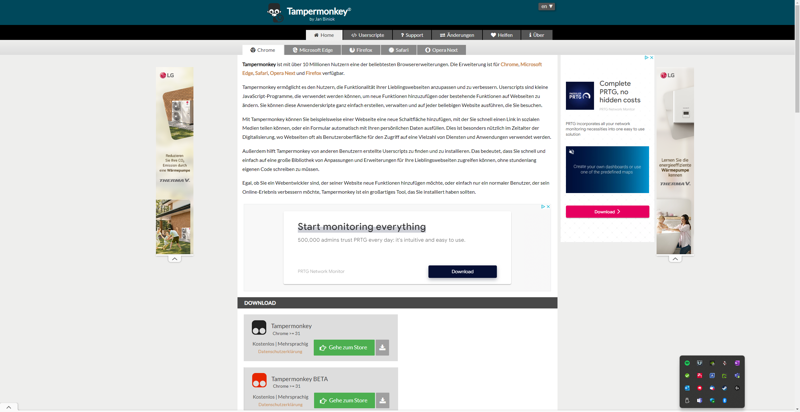
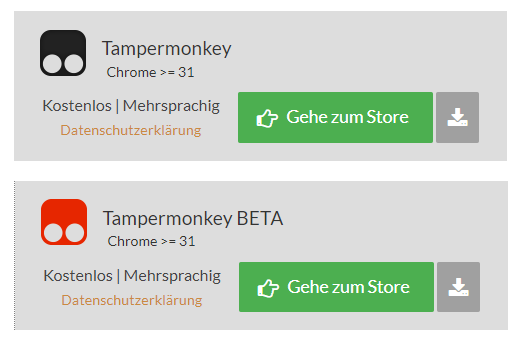
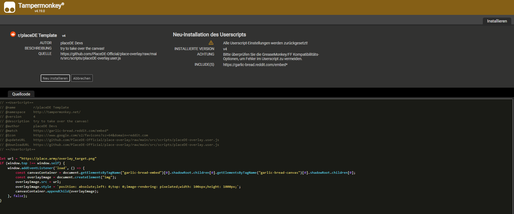
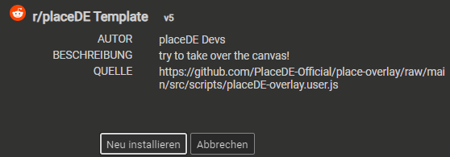

# Overlay installieren

1. https://www.tampermonkey.net/ öffnen
   
   

2. Unter "Download" mit "Gehe zum Store" das Plugin installieren -> Weiterleitung zu den App-Stores dort installieren
   
   

3. Anschließend auf diesen Link klicken: https://github.com/PlaceDE-Official/place-overlay/raw/main/src/scripts/placeDE-overlay.user.js. Tampermonkey sollte das Skript erkennen.
   
   
   
4. Script in Tampermonkey installieren oder updaten/neu installieren 
   
   

5. F5 drücken, wann immer aktualisiert wird.